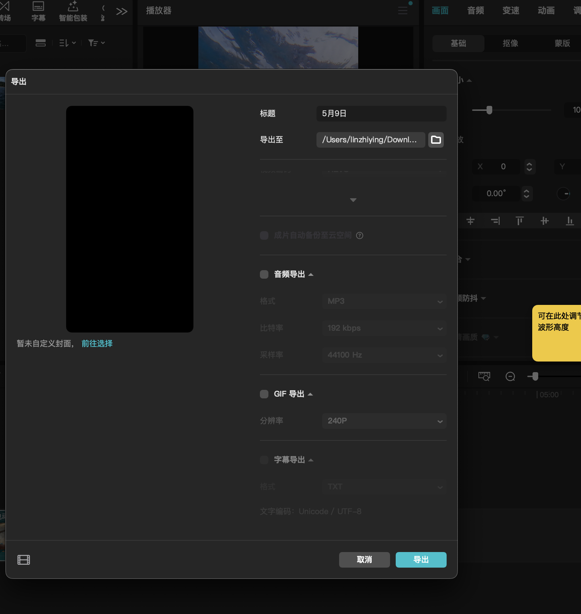

大游艇好多珊瑚啊
就从这里下
拿装备啥也别说了
好装板啊
一共就装3个东西
插头放进去好
把这一放
4个螺丝一拧就搞定了
因为如果我一跑起来
这两个板的速度差嘛
这个尾翼好
这样就装好一块
然后我再装另外一块
然后两个遥控先装到这里面
装上电池
嗯这里有个卡扣啊
摁一下摁一下就行
遥控器长按中间的
开机就可以了哎呦
丰收的走位开始了哈哈哈
有一个大游艇
到了到了
好多珊瑚啊
沙子好白啊这资源
do you feel
good
I
oh加井岛很好玩啊
水也很清澈
然后现在我们收工回家了
Yoo hoo
